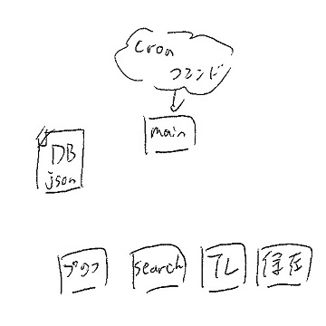
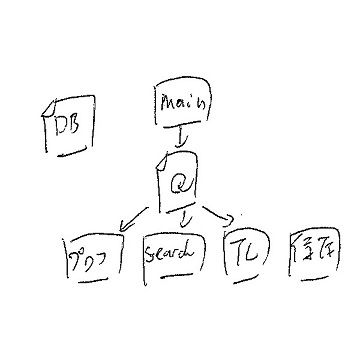
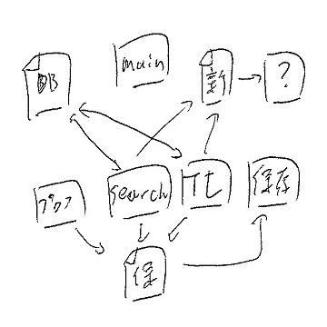

# TLDownloader
twitter TLimg Downloader 

## 残タスク
Tweepyを使用(もう更新されないみたいだしAPIで処理するよう書き直す) 
認証用トークンデータをDBへ。生データはまずい？ 

## APIキー、アクセストークンの取得
Twitterアカウントの「設定」メニューの「モバイル」を開き電話番号を入力し認証。 
認証後は電話番号を削除すれば他アカウントにも使える（たぶん）

下記ＵＲＬからTwitterアプリを作成

https://apps.twitter.com/

※作成の際に作成理由？みたいなのを300字ぐらい入れなきゃならない。適当に打ってもダメっぽい？

「Key and Access Tokens」の「Create my access token」をクリック

## フロー(予定は未定)
<pre>
# python3 main.py
# python3 main.py --add-object
# python3 main.py --name 名前 --add-query tag1 tag2...
or
直でjson書く
</pre>

## json
-DB
TLやプロフを収集するユーザのscreenとnameと最終取得日
検索ワードと最終取得日  
<pre>
json = [
	{
		"name":&lt;screen or 検索名&gt;,					#作業フォルダ名
		"Query":{&lt;tag1&gt;:{"id":&lt;id&gt;, "date":&lt;lastdate&gt;}, ...},		#searchで使用
		"Profileflag":&lt;False or True&gt;,					#プロフ監視するか
		"TLflag":{"id":&lt;id&gt;, "date":&lt;lastdate&gt;},			#TL保存するか
		"RTflag":&lt;False or True&gt;,					#TL保存の時にRTを含めるか
		"videoflag":&lt;False or True&gt;,					#動画を保存するか
		"gifflag":&lt;False or True&gt;					#gifを保存するか
	},
	...
]
</pre>

## 参考にさせていただいたサイト 
PythonでTwitter API を利用していろいろ遊んでみる 
https://qiita.com/bakira/items/00743d10ec42993f85eb 
Python で Twitter API にアクセス 
https://qiita.com/yubais/items/dd143fe608ccad8e9f85 
Pythonでサクッと簡単にTwitterAPIを叩いてみる 
https://qiita.com/ogrew/items/0b267f57b8aaa24f1b73 
Python と Twitter API でリツイートしたユーザーの情報を取得する 
https://www.topgate.co.jp/rookie-python-twitter-api 
TwitterAPI でツイートを大量に取得。サーバー側エラーも考慮（pythonで） | コード７区 
http://ailaby.com/twitter_api/ 
Pythonで特定のTwitterアカウントの投稿した画像を取得する - ayihiscope 
http://ayihis.hatenablog.com/entry/2016/06/24/172435 
PythonでTwitterを使う 〜Tweepyの紹介〜 - kivantium活動日記 
http://kivantium.hateblo.jp/entry/2015/01/03/000225 
[python]twitterでフォローしている人の画像を一括ダウンロード 
https://daichan.club/python/78113 
tweepy で フォローした人をリストアップする - 3846masa's memo 
http://3846masa.hatenablog.jp/entry/2015/02/10/163119 
API Reference — tweepy 3.5.0 documentation 
http://docs.tweepy.org/en/v3.5.0/api.html?highlight=RateLimitError#RateLimitError 
python - Avoid twitter api limitation with Tweepy - Stack Overflow 
https://stackoverflow.com/questions/21308762/avoid-twitter-api-limitation-with-tweepy 
### hasattrについて 
属性の有無チェック (hasattr) | Python-izm 
https://www.python-izm.com/advanced/hasattr/ 
### jsonから抜き出す 
Can't use retweeted_status field? - Google グループ 
https://groups.google.com/forum/#!topic/tweepy/OsVtI9ZRRAw 
### python3の変更点について 
python - 'dict' object has no attribute 'has_key' - Stack Overflow 
https://stackoverflow.com/questions/33727149/dict-object-has-no-attribute-has-key 
Python2からPython3.0での変更点 - Qiita 
https://qiita.com/CS_Toku/items/353fd4b0fd9ed17dc152 
### since_idとmax_idについて 
Twitter API Timeline解説 - のんびりしているエンジニアの日記 
http://nonbiri-tereka.hatenablog.com/entry/2014/03/06/220015 
Twitter APIのsince_idの仕様を勘違いしていた… - 風柳メモ 
https://furyu.hatenablog.com/entry/20100124/1264342029 
### sinceとuntilについて 
TwitterAPIで期間指定してTweetを取得する方法 
https://qiita.com/areph/items/0745cb744a12810334c6 
### ハッシュタグによるツイート検索 
Twitter APIでつぶやきを取得する - Qiita 
https://qiita.com/yokoh9/items/760e432ebd39040d5a0f 
### APIレスポンス 
Pythonメモ: Tweepyのややこしいレスポンスデータの読み方 ?Twitter API活用の最初の難関? - StatsBeginner: 初学者の統計学習ノート 
http://www.statsbeginner.net/entry/2017/02/12/231400 
Entities - Twitter 開発者ドキュメント 日本語訳 
http://westplain.sakuraweb.com/translate/twitter/API-Overview/Entities.cgi 
### 入れ子の辞書・リストの参照について 
【Python】辞書に辞書を追加する。append()、extend() ( ソフトウェア ) 
https://blogs.yahoo.co.jp/dpdtp652/39381397.html 
### 正規表現 
Bugle Diary: [Python]Twitterのようにハッシュタグを検索する方法 
http://temping-amagramer.blogspot.com/2014/11/pythontwitter.html 
Twitterのつぶやきにある2つ以上の#(ハッシュタグ)にリンクをつけたいときの正規表現について ? エコテキブログ 
https://e-yota.com/webservice/post-2441/ 
pythonで正規表現を使ってみる - すこしふしぎ． 
http://ism1000ch.hatenablog.com/entry/2014/03/15/154533 
### その他 
コマンドライン引数 | Python-izm 
https://www.python-izm.com/basic/command_line_arguments/ 
pythonでコマンドライン引数を使うサンプル 
https://qiita.com/stkdev/items/e262dada7b68ea91aa0c 
【Python入門】argparseでコマンドライン引数を扱う方法 | 侍エンジニア塾ブログ 
https://www.sejuku.net/blog/23647 
